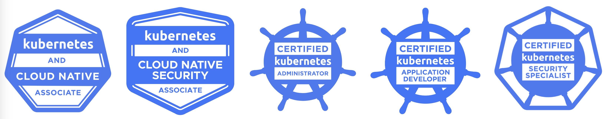

# Introducing CNCF Kubernetes Certificates

Learn about the CNCF certificates, especially CKS.

---

# CNCF Kubernetes Certificates

1. Certified Kubernetes Administrator (CKA) (practical exam)
2. Certified Kubernetes Application Developer (CKAD) (practical exam)
3. Certified Kubernetes Security Specialist (CKS) (practical exam)
4. Kubernetes and Cloud Native Associate (KCNA) (multiple choice exam)
5. Kubernetes Certified Service Provider (KCSP) (multiple choice exam)

<div style="font-size: 0.8em;">
- CKA: 85, needed: 66<br>
- CKAD: 95, needed: 66<br>
- CKS: 68, needed: 67  (first try: 61)<br>
- KCNA: 86, needed: 75<br>
- KCSA: 82, needed: 75
</div>

---

# CKS Certificate


---

# Kubestronaut


When you pass all five exams, you become a [Kubestronaut!](https://www.cncf.io/training/kubestronaut/)

---

# Practical Exam

- Remote desktop to a remote server
- Multiple Kubernetes clusters
- Add, fix, or secure things
- Limited time: 2 hours
- Only [kubernetes.io/docs](https://kubernetes.io/docs) allowed
- Use Kubernetes docs minimally

---

# Tips and Tricks

- Save Time with alias and $do and $now
```sh
alias k='kubectl -n prod'

export do='--dry-run=client -o yaml'
k run nginx --image nginx $do > pod.yaml

export now='--grace-period=0 --force'
k delete pod nginx $now
```

- leave falco task for the end
- terminal preferences: "automatically copy selection to clipboard"
-	`k replace -f pod.yaml --force`
- before adding the volumes and volumeMounts, first check, maybe they have added them already.

---

# Exam Process

## Before the Exam

- Room check via camera
- No looking away from the monitor
- No one allowed to enter the room

---

# Resources

- Course: [kodekloud.com](https://kodekloud.com)
- Mock Exam: [killer.sh](https://killer.sh)
- Practice: [killercoda.com](https://killercoda.com/)

---

# Exam Details

- One year registration validity
- Two attempts allowed
- Minimum score requirements
- My scores: [Your Scores Here]

---

# CKS Topics

## Cluster Setup Domain – 15%

- Use Network security policies
- Use CIS benchmark for security configuration
- Set up Ingress with TLS
- Protect node metadata and endpoints
- Verify platform binaries

---

## Cluster Hardening Domain – 15%

- Use Role Based Access Controls
- Exercise caution with service accounts
- Restrict access to Kubernetes API
- Upgrade Kubernetes

---

## System Hardening Domain – 10%

- Minimize host OS footprint
- Use least-privilege identity and access management
- Minimize external network access
- Use kernel hardening tools

---

## Minimize Microservice Vulnerabilities Domain – 20%

- Use appropriate pod security standards
- Manage Kubernetes secrets
- Implement isolation techniques
- Implement Pod-to-Pod encryption

---

## Supply Chain Security Domain – 20%

- Minimize base image footprint
- Understand and secure your supply chain
- Perform static analysis of workloads

---

## Monitoring, Logging and Runtime Security Domain – 20%

- Perform behavioral analytics
- Detect threats
- Investigate attacks
- Ensure container immutability
- Use Kubernetes audit logs

---
