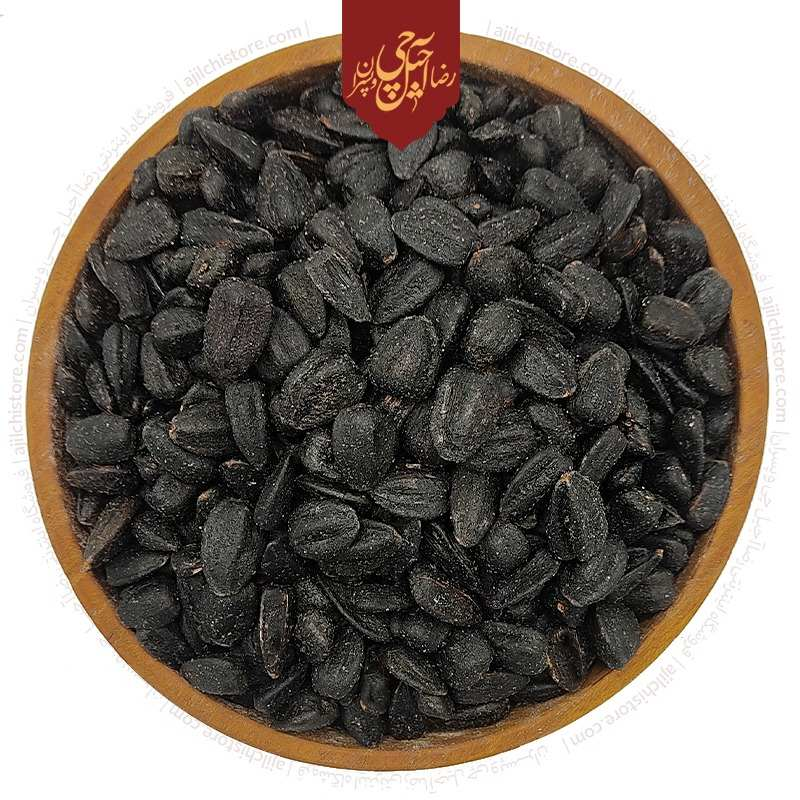
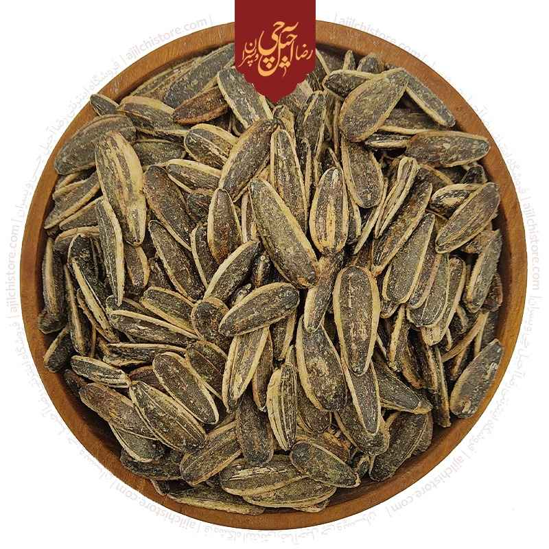
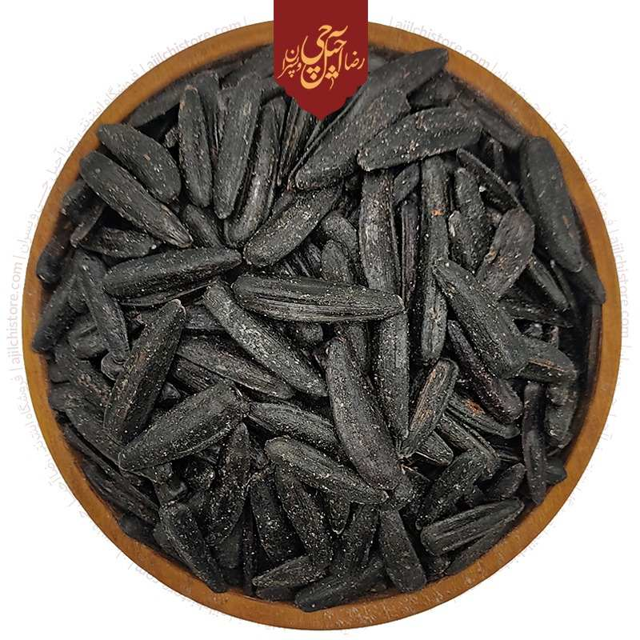
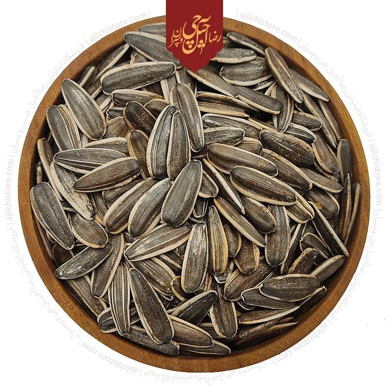

# Persian Snacks

Discover the rich history and culture of Iran through its traditional snacks.

  
    Press Space for next page <carbon:arrow-right class="inline"/>
  

---

# Table of Contents

  <Toc minDepth="1" maxDepth="2"></Toc>

---
# Sunflower Seeds
class: text-center
---

# Sunflower Seeds

  

    
    
    
    
  

Sunflower seeds are a popular snack in Iran, often enjoyed while socializing with friends and family.

---

# Pumpkin Seed

Pumpkin seeds are another favorite, known for their crunchy texture and nutritional benefits.

---

# Red Pumpkin Seed

Red pumpkin seeds are a unique variety, offering a slightly different flavor and a vibrant color.

---

# Lavashak (Sour Fruit Leather)

Lavashak is a tangy and chewy snack made from dried fruits, often enjoyed for its intense sour flavor.

---

# Pashmak (Cotton Candy)

Pashmak is a traditional Persian cotton candy, known for its delicate texture and sweet taste.

---

# Nabat (Rock Candy)

Nabat is a crystallized sugar treat, often flavored with saffron or other spices, and used in tea.

---

# Rotab (Persian Dates)

Rotab are Persian dates, prized for their sweetness and often enjoyed as a healthy snack.

---

# Golab (Rose Water)

Golab, or rose water, is used in many Persian desserts and drinks, adding a fragrant floral note.

---

# Gaz (Persian Nougat)

Gaz is a traditional Persian nougat, made with pistachios and flavored with rose water or saffron.

---

# Naderi Cookie

Naderi cookies are a classic Persian treat, known for their buttery texture and delicious flavor.

---

# Saffron

Saffron is a prized spice in Persian cuisine, used in a variety of dishes for its unique flavor and color.

---

# Sohan (Persian saffron brittle toffee)

Sohan is a traditional Persian brittle toffee, flavored with saffron and often garnished with pistachios.

---

# Bastani Sonnati (Persian saffron ice cream with rose water and pistachios)

Bastani Sonnati is a traditional Persian ice cream, made with saffron, rose water, and pistachios.

---

# Saffron Tea

Saffron tea is a fragrant and soothing beverage, enjoyed for its unique flavor and health benefits.

---

# Faloodeh (vermicelli-sized noodles with syrup)

Faloodeh is a traditional Persian dessert, made with vermicelli-sized noodles and a sweet syrup.

---

# Nokhodchi Kishmish

Nokhodchi Kishmish is a delightful Persian snack, combining roasted chickpeas and raisins for a sweet and savory treat.

---

# Conclusion

Persian snacks offer a delightful way to experience the rich culinary heritage of Iran. Enjoy these treats and explore the flavors of Persian culture.

  
    Press Space for next page <carbon:arrow-right class="inline"/>
  

---

# Some links

- [Top Persian Snacks](https://www.eavartravel.com/blog/2023/11/10/140734/persian-snacks/)
